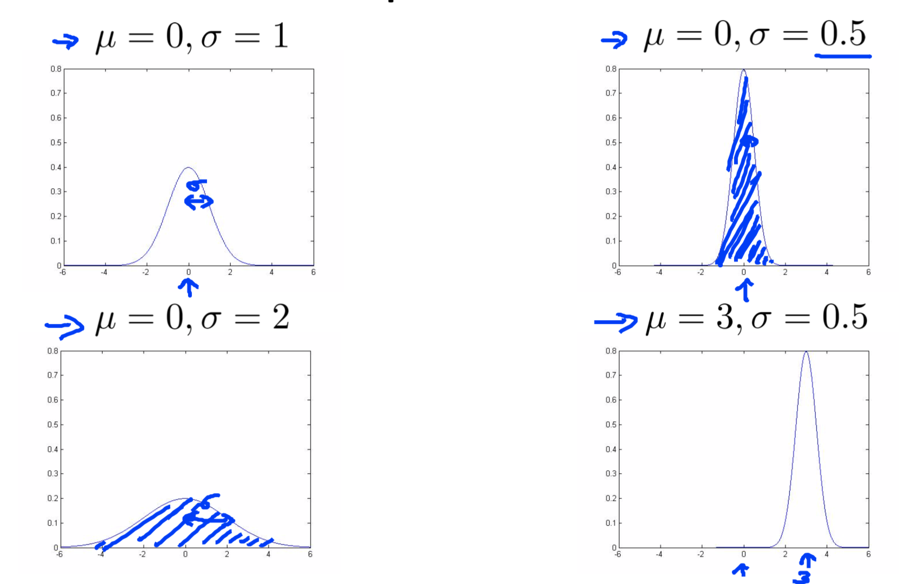
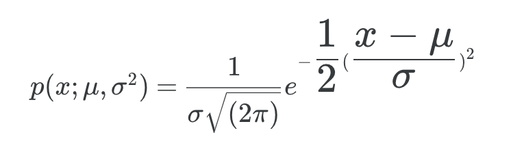
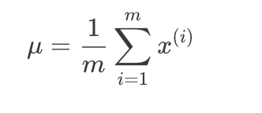
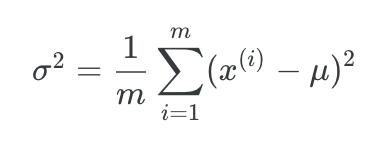
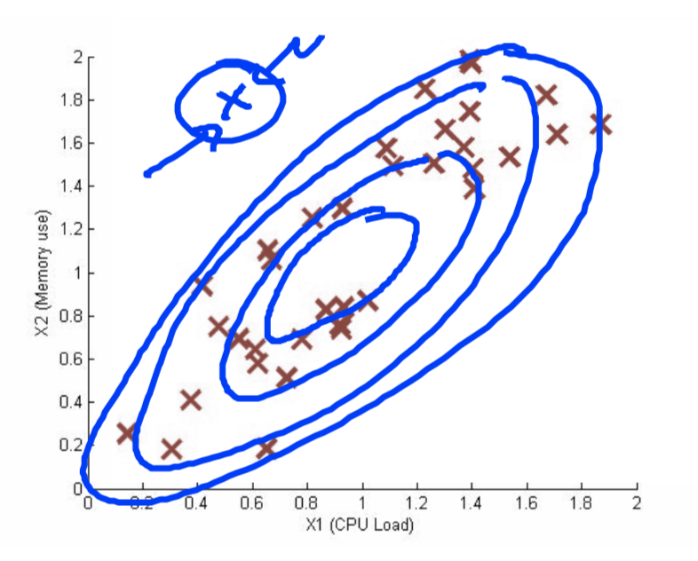
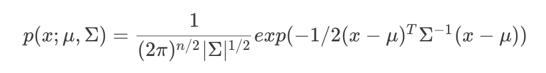

# Anomaly Detection

## Gaussian Distribution









```matlab
function [mu sigma2] = estimateGaussian(X)
[m, n] = size(X);
mu = mean(X)';
sigma2 = (var(X) .* (m - 1) / m)';
end
```


## 异常检测算法


### 选择epslion

```matlab
function [bestEpsilon bestF1] = selectThreshold(yval, pval)
% yval: 实际值
% pval: 预测值
bestEpsilon = 0;
bestF1 = 0;
F1 = 0;

stepsize = (max(pval) - min(pval)) / 1000;
for epsilon = min(pval):stepsize:max(pval)
    predictions = (pval < epsilon);

    tp = sum((predictions == 1) & (yval == 1));

    fp = sum((predictions == 1) & (yval == 0));

    fn = sum((predictions == 0) & (yval == 1));

    prec = tp / (tp + fp);

    rec = tp / (tp + fn);

    F1 = 2 * prec * rec / (prec + rec);
    
    if F1 > bestF1
       bestF1 = F1;
       bestEpsilon = epsilon;
    end
end
end
```


## Multivariate Gaussian Distribution

以下问题会更适合用这种算法





```matlab
function p = multivariateGaussian(X, mu, Sigma2)
k = length(mu);

if (size(Sigma2, 2) == 1) || (size(Sigma2, 1) == 1)
    Sigma2 = diag(Sigma2);
end

X = bsxfun(@minus, X, mu(:)');
p = (2 * pi) ^ (- k / 2) * det(Sigma2) ^ (-0.5) * ...
    exp(-0.5 * sum(bsxfun(@times, X * pinv(Sigma2), X), 2));

end
```

## Detail

https://www.coursera.org/learn/machine-learning/resources/szFCa

