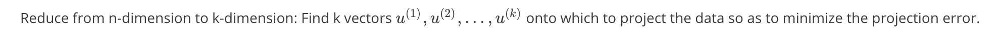
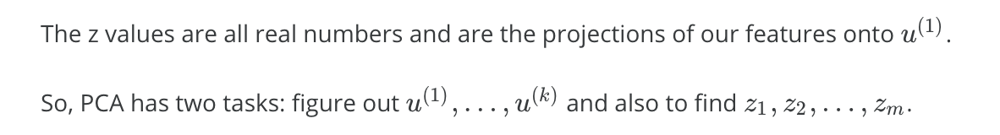
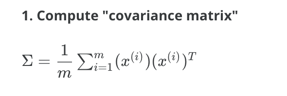
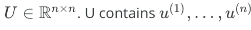
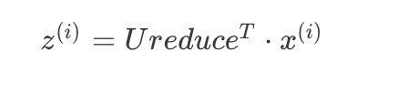
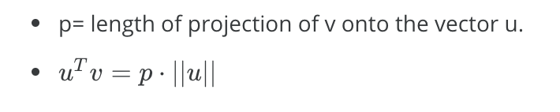
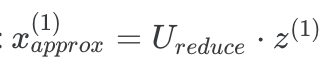
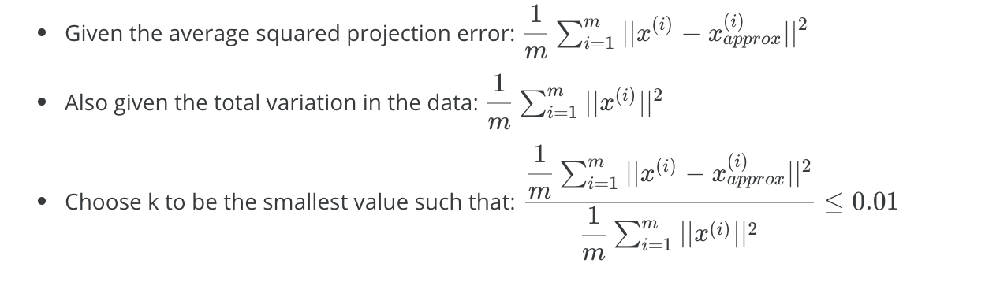
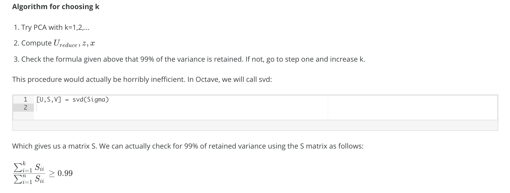

# Dimensionality Reduction

## For what

- 数据压缩节约时间、空间
- 数据可视化


## PCA

Principal Component Analysis，主成分分析

### Problem Formulation

投影：



这里，u还是n维的。

一个n维的点，投影到k个向量后，在每个向量处有一个值，共k个值，构成一个k维向量，这就是降维后的点。

projection error：点到投影面的距离。

最优化目标：min of average of square projection error。



### Algorithm

数据预处理：特征规范化



```matlab
Sigma = (1/m) * X' * X;
```

**2. Compute "eigenvectors" of covariance matrix**

```matlab
[U,S,V] = svd(Sigma);
% svd = singular value decomposition
```

U:

**3. Take the first k columns of the U matrix and compute z**



```matlab
Ureduce = U(:,1:k);     % take the first k directions
Z = X * Ureduce;        % compute the projected data points
```

这里，计算投影z时，用到了向量内积的性质：



### Reconstruction

重建：从映射结果求原来的值。

会有误差。

重建公式用到了U的特殊性质，Unitary Matrix的性质，即其逆等于其共轭，而实数矩阵的共轭又是它的转置。



```matlab
Ureduce = U(:,1:k); 
X_rec = Z * Ureduce';
```


### 选择k的大小





```matlab
Sk = 0;
for i = 1:k
	Sk = Sk + S(i,i);
end
Sn = 0;
for i = 1:n
	Sn = Sn + S(i,i);
end
variance = Sk / Sn;
```


## Detail

[Ng lecture notes of week 8](https://www.coursera.org/learn/machine-learning/resources/kGWsY)

