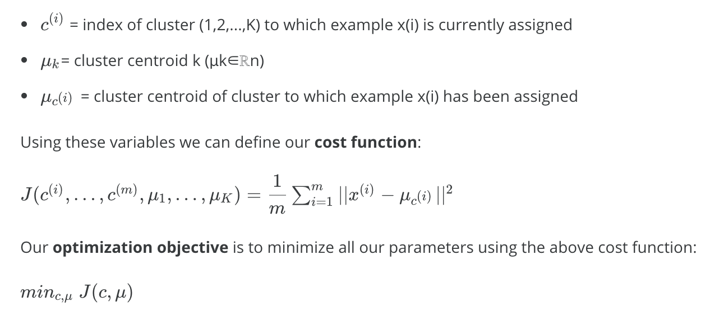

# K-Means Clustering

流行、使用广泛。

## 算法计算步骤

- 计算x_m中每个x_i到u_K中每个u_j的距离，最小的那个距离对应的j，表示x_i的cluster

```matlab
function idx = findClosestCentroids(X, centroids)
% 返回idx表示idx[i] == j表示，X(i,:) example距离最近的centroid是centroids(j,:)

K = size(centroids, 1);
idx = zeros(size(X,1), 1);

for i=1:size(X, 1)
    x = X(i,:);
    minDisSquare = realmax;
    for j=1:K
        disSquare = (x - centroids(j,:)) * (x - centroids(j,:))';
        if disSquare < minDisSquare
            minDisSquare = disSquare;
            idx(i) = j;
        end
    end
end
end
```

- 更新u_j为每个属于j的cluster的x的评均值

```matlab
function centroids = computeCentroids(X, idx, K)
[m n] = size(X);
centroids = zeros(K, n);
idx = idx(:);
for i=1:K
    clusterI = find(idx == i);
    Xi = X(clusterI, :);
    centroids(i,:) = mean(Xi);
end
end
```

迭代以上2个步骤：

```matlab
function [centroids, idx] = runkMeans(X, initial_centroids, ...
                                      max_iters, plot_progress)
[m n] = size(X);
K = size(initial_centroids, 1);
centroids = initial_centroids;
previous_centroids = centroids;
idx = zeros(m, 1);

for i=1:max_iters
idx = findClosestCentroids(X, centroids);
centroids = computeCentroids(X, idx, K);
end
end
```


关键的观察在于，每迭代一次，Cost Function的值不会增加，而是减小。

这个算法理解起来比价容易。

## Cost Function

所有x_m到对应的u_j的距离的平均值。



## 实现

- Random Initialization
  - 随机选x_m中的k个example作为初始cluster centroid是一个好的选择
  - 会发生local optima，应随机运行多次，求最小J对应的结果

```matlab
function centroids = kMeansInitCentroids(X, K)
randidx = randperm(size(X, 1));% 随机排列
centroids = X(randidx(1:K), :);
end
```

- K的选择
  - 一般是by hand，没有太好办法
  - Elbow method，不怎么有用
  - downstream purpose

## Detail

[Ng lecture notes of week 8](https://www.coursera.org/learn/machine-learning/resources/kGWsY)