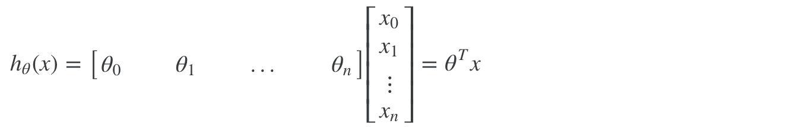
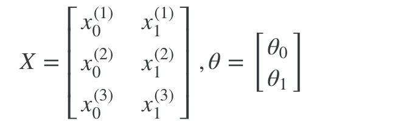
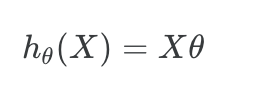
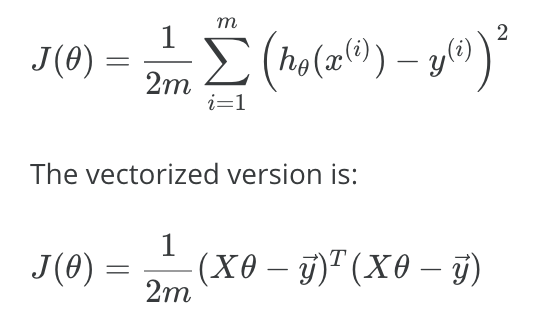
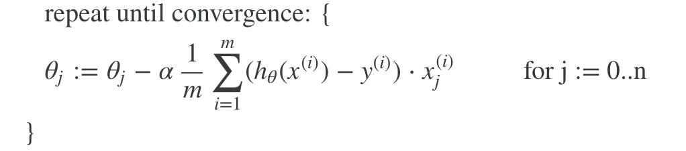
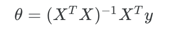
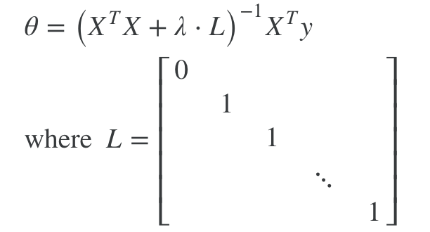
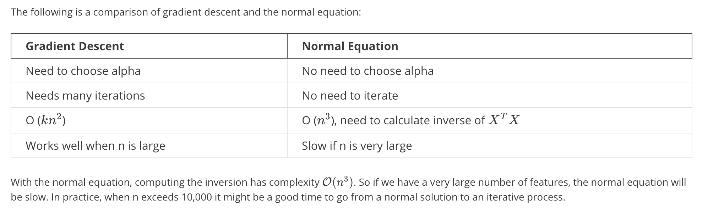
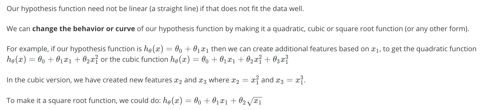

# Linear Regression

## Hypothesis Function

线性回归的假说函数，是一个线性函数，如下：



```matlab
h = theta' * x;
```







```matlab
h = X * theta;
```

## Cost Function

代价函数是计算假说函数求出的值和实际值之间的误差的总和：



```matlab
function J = computeCostMulti(X, y, theta)
	m = length(y); 
	J = (X * theta - y)' * (X * theta - y) / (2 * m);
end
```

正则化：

```matlab
function J = computeCostMultiReg(X, y, theta, lambda)
	m = length(y); 
	J = (X * theta - y)' * (X * theta - y) / (2 * m);
	J = J + lambda / (2 * m) * theta(2:end)' * theta(2:end);
end
```

## Gradient Descent




```matlab
function [theta, J_history] = gradientDescentMulti(X, y, theta, alpha, num_iters)
	m = length(y); 
	J_history = zeros(num_iters, 1);

    for iter = 1:num_iters
        theta = theta - (alpha / m) * X' * (X * theta - y);
        J_history(iter) = computeCostMulti(X, y, theta);
    end
end
```

正则化：

```matlab
grad = 1 / m * X' * (X * theta - y) + lambda / m * [0;theta(2:end)];
```


## Normal Equation

代价函数对theta求偏导，最小值是偏导等于0时的theta，因而可以直接计算theta，而不用梯度下降。



```matlab
function [theta] = normalEqn(X, y)
	theta = zeros(size(X, 2), 1);
	theta = pinv(X' * X) * X' * y;
end
```

正则化：



```matlab
function [theta] = normalEqn(X, y, lambda)
	L = eye(size(X,2));
	L(1,1) = 0;
	theta = pinv(X' * X + lambda * L) * X' * y;
end
```


## 解法的选择



## Polynomial Regression

对线性回归进行特指映射，算法就变成多项式回归。



[Feature Mapping](Feature-Mapping.md)

## Advanced Optimization

``` matlab 
function [J, grad] = costFunctionReg(theta, X, y, lambda)
m = length(y);
J = (X * theta - y)' * (X * theta - y) / (2 * m);
J = J + lambda / (2 * m) * theta(2:end)' * theta(2:end);
grad = 1 / m * X' * (X * theta - y) + lambda / m * [0;theta(2:end)];
end
```

```matlab
[m, n] = size(X);
X = [ones(m, 1) X];
initial_theta = zeros(n + 1, 1);
lambda = 1;
[cost, grad] = costFunctionReg(initial_theta, X, y, lambda);

initial_theta = zeros(n + 1, 1);
lambda = 1;
options = optimset('GradObj', 'on', 'MaxIter', 400);
[theta, J, exit_flag] = ...
	fminunc(@(t)(costFunctionReg(t, X, y, lambda)), initial_theta, options);
```

