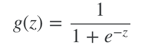
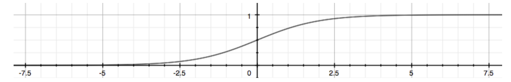
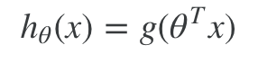
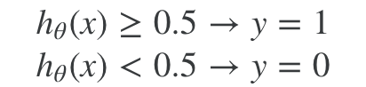
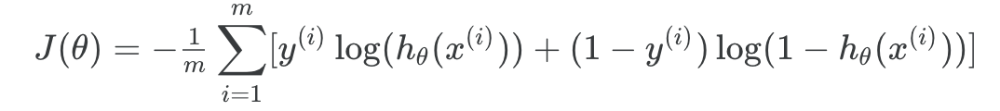
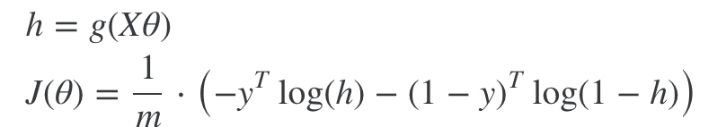
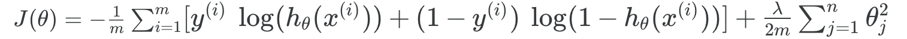
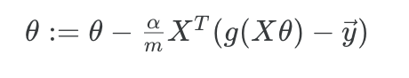
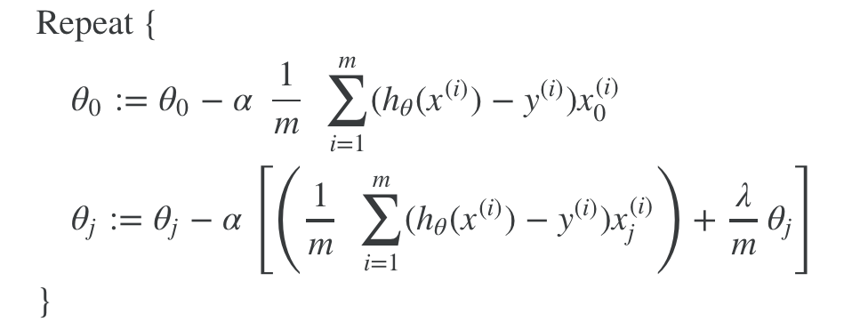

# Logistic Regression

Logistic Regression(逻辑回归)，不是回归算法，而是分类算法。Ng说这种命名是历史问题。

Logistic得名于Sinmoid Function也叫Logistic Function。Logistic Function得名于1844，作者并没有说明原因[see Logistic Function wiki]。

逻辑回归用来进行分类。包括2个结果的分类和多个结果的分类。

## Sigmoid Fuction (Logistic Function)

一个值落在0和1之间的函数





```matlab
function g = sigmoid(z)
g = 1./(1+exp(-z));
end
```


## Hypothesis Function

为了用于分类，把线性回归的值，用sigmoid函数映射到0-1



```matlab
h = sigmoid(theta' * x);
```





```matlab
h = sigmoid(X * theta);
```


## Decision Boundary

The **decision boundary** is the line that separates the area where y = 0 and where y = 1

对于逻辑回归来说，就是g(z)中，z=0对应的边界。

## Cost Function

非矢量化：



矢量化：



非矢量化，正则化：



为什么代价函数长这样？1）预测值越接近实际值，代价越小。2）使偏导能和线性回归一样（地简洁）

## Gradient Descent

矢量化：



非矢量化，正则化：



代价函数和梯度下降(正则化)：

```matlab
function [J, grad] = costFunctionReg(theta, X, y, lambda)
m = length(y);
h = sigmoid(X * theta);
J = 1 / m * (-y' * log(h) - (1 - y)' * log(1 - h))...
    + lambda / (2 * m) * (theta(2:end)' * theta(2:end));
grad = 1 / m * X' * (h - y) + lambda / m * [0;theta(2:end)];
end
```

Cost Function的偏导数为什么和线性规划的一样，怎么推导出来的

- answer1: [derivative of cost function for Logistic Regression](https://math.stackexchange.com/questions/477207/derivative-of-cost-function-for-logistic-regression)
- anwser2: Week3 Lecture Notes中也有推导

## Advanced Optimization

比梯度下降更复杂、更快的高级优化算法。

"Conjugate gradient", "BFGS", and "L-BFGS" are more sophisticated, faster ways to optimize θ that can be used instead of gradient descent. 

实现：

fminunc：an optimization solver that finds the minimum of an unconstrained function in matlab or octave。

```matlab
[m, n] = size(X);
X = [ones(m, 1) X];
initial_theta = zeros(n + 1, 1);
lambda = 1;
[cost, grad] = costFunctionReg(initial_theta, X, y, lambda);

initial_theta = zeros(n + 1, 1);
lambda = 1;
options = optimset('GradObj', 'on', 'MaxIter', 400);
[theta, J, exit_flag] = ...
	fminunc(@(t)(costFunctionReg(t, X, y, lambda)), initial_theta, options);
```

## One-vs-all: 多个结果的分类

对于逻辑回归来说，one-vs-all是：有多少个分类，就训练多少个假说函数。每个输入，都输入这些假说函数，输出值最大的假说函数的输出，就是输入对应的预测输出值。

```matlab
function [all_theta] = oneVsAll(X, y, num_labels, lambda)
m = size(X, 1);
n = size(X, 2);
all_theta = zeros(num_labels, n + 1);
X = [ones(m, 1) X];
initial_theta = zeros(n + 1, 1);
options = optimset('GradObj', 'on', 'MaxIter', 50);
for c = 1 : num_labels
    [theta] = fmincg (@(t)(lrCostFunction(t, X, (y == c), lambda)), ...
            initial_theta, options);
    all_theta(c,:) = theta';
end
```

```matlab
function p = predictOneVsAll(all_theta, X)
m = size(X, 1);
num_labels = size(all_theta, 1);
p = zeros(size(X, 1), 1);
X = [ones(m, 1) X];

[w, p] =  max(sigmoid(all_theta * (X'))',[],2);//按行求最大值，并返回下标到p

end
```


