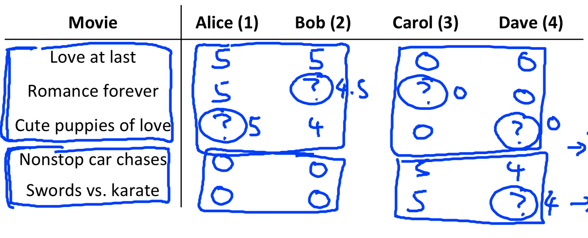
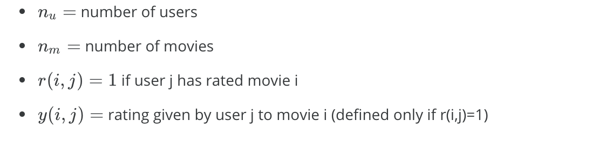
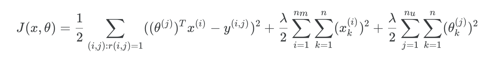
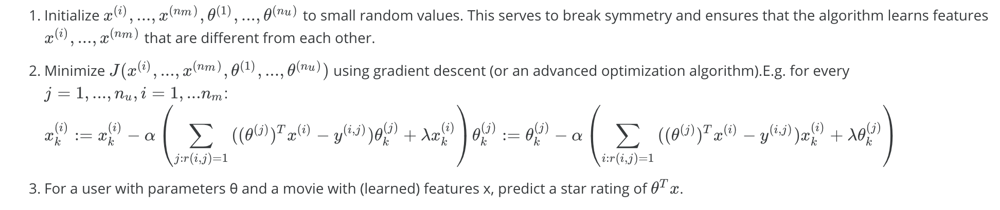
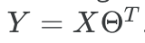

# Recommender System

## Problem Formulation





## Collaborative Filtering







```matlab
function [J, grad] = cofiCostFunc(params, Y, R, num_users, num_movies, ...
                                  num_features, lambda)
% X = num_movies * num_features
% Theta = num_users * num_features
% Y = num_movies * num_users
% R = num_movies * num_users

X = reshape(params(1:num_movies*num_features), num_movies, num_features);
Theta = reshape(params(num_movies*num_features+1:end), ...
                num_users, num_features);

J = 0;
X_grad = zeros(size(X));
Theta_grad = zeros(size(Theta));

% J
E = X * Theta';
J = 1/2 * sum(sum(((E - Y).*R).^2));
Re = lambda / 2 * sum(sum(Theta.^2)) + lambda / 2 * sum(sum(X.^2));
J = J + Re;

% grad
for i = 1:num_movies
    idx = find(R(i, :)==1);
    ThetaTemp = Theta(idx, :);
    YTemp = Y(i, idx);
    X_grad(i, :) = (X(i,:) * ThetaTemp' - YTemp) * ThetaTemp;
    X_grad(i, :) = X_grad(i, :) + lambda * X(i, :);
end

for j = 1:num_users
    idx = find(R(:, j)==1);
    XTemp = X(idx, :);
    YTemp = Y(idx, j)';
    Theta_grad(j, :) = (Theta(j, :) * XTemp' - YTemp) * XTemp;
    Theta_grad(j, :) = Theta_grad(j, :) + lambda * Theta(j, :);
end

grad = [X_grad(:); Theta_grad(:)];
end
```

学习：

```matlab
[Ynorm, Ymean] = normalizeRatings(Y, R);
num_users = size(Y, 2);
num_movies = size(Y, 1);
num_features = 10;
X = randn(num_movies, num_features);
Theta = randn(num_users, num_features);
initial_parameters = [X(:); Theta(:)];

options = optimset('GradObj', 'on', 'MaxIter', 100);
lambda = 10;
theta = fmincg (@(t)(cofiCostFunc(t, Ynorm, R, num_users, num_movies, ...
                                num_features, lambda)), ...
                initial_parameters, options);
X = reshape(theta(1:num_movies*num_features), num_movies, num_features);
Theta = reshape(theta(num_movies*num_features+1:end), ...
                num_users, num_features);
                
p = X * Theta';
my_predictions = p(:,1) + Ymean;
```


## 均值规范化


```matlab
function [Ynorm, Ymean] = normalizeRatings(Y, R)

[m, n] = size(Y);
Ymean = zeros(m, 1);
Ynorm = zeros(size(Y));
for i = 1:m
    idx = find(R(i, :) == 1);
    Ymean(i) = mean(Y(i, idx));
    Ynorm(i, idx) = Y(i, idx) - Ymean(i);
end

end
```

