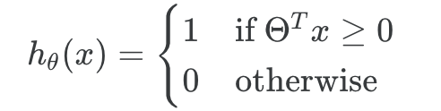
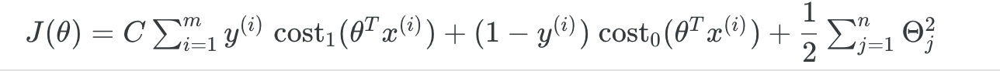
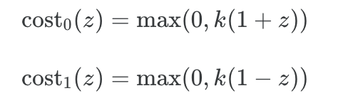

# Support Vector Machine

## Hythposis function

## Cost Function

## Large Margin

The distance of the decision boundary to the nearest example is called the **margin**. Since SVMs maximize this margin, it is often called a *Large Margin Classifier*.

## Kernel

**Kernels** allow us to make complex, non-linear classifiers using Support Vector Machines.

Gaussian Kernel:

