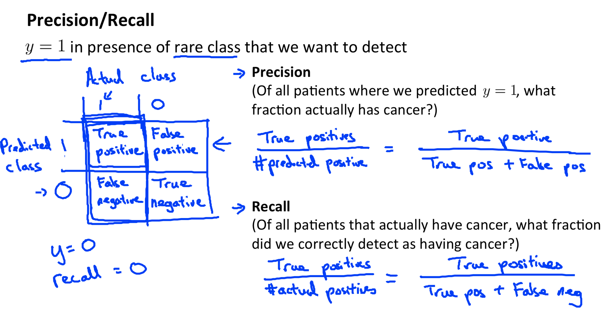
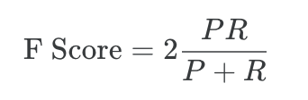

# System Design

The recommended approach to solving machine learning problems is:

- Start with a simple algorithm, implement it quickly, and test it early.

- Plot learning curves to decide if more data, more features, etc. will help

- Error analysis: manually examine the errors on examples in the cross validation set and try to spot a trend.

## Error Metrics for Skewed Classes

Precision  and Recall

F Score 

Accuracy

## Data

more data may good: 

In certain cases, an "inferior algorithm," if given enough data, can outperform a superior algorithm with less data.

enough information:

We must choose our features to have enough information. A useful test is: Given input x, would a human expert be able to confidently predict y?

## Details

[Week 6 Lecture Notes](https://www.coursera.org/learn/machine-learning/resources/LIZza)
