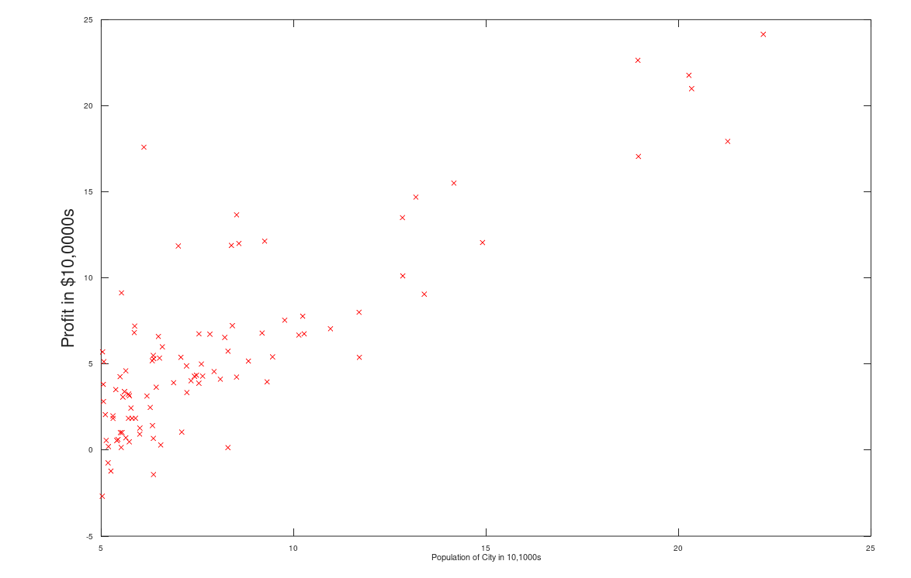
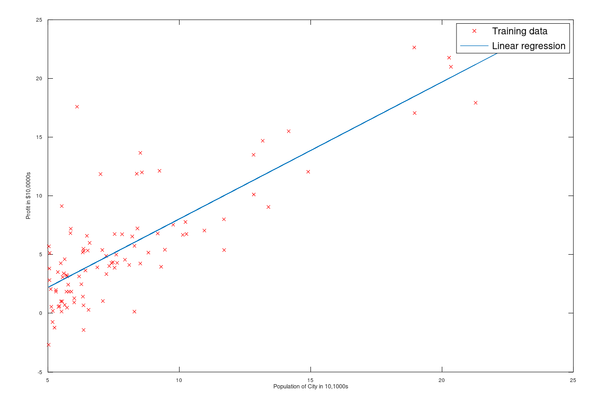
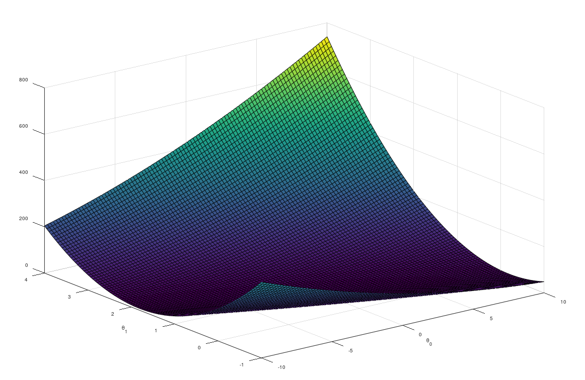
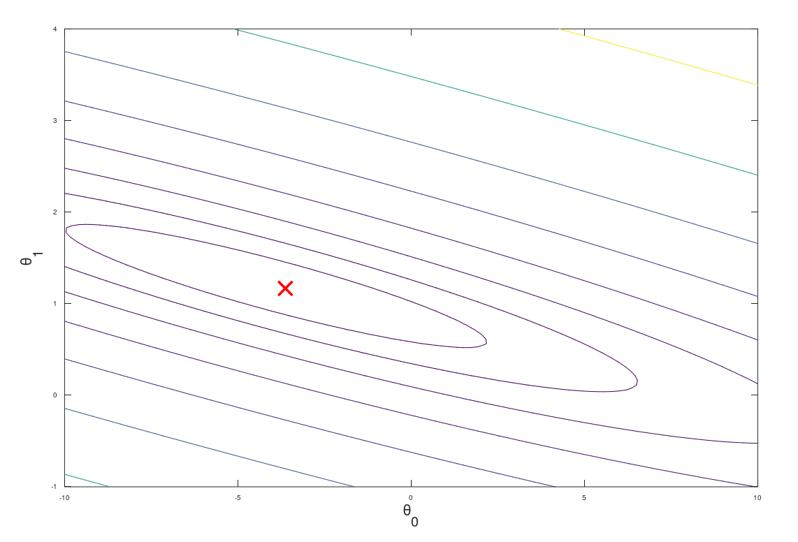

# Visualization

## plot



```matlab
function plotData(x, y)
figure;
plot(x, y, 'rx', 'MarkerSize', 3);
xlabel('Population of City in 10,1000s');
ylabel('Profit in $10,0000s');
end
```




```matlab
plot(x, y, '-');%-画线
```

## surf



```matlab
surf(x, y, Z);
```


## contour



```matlab
contour(x, y, Z);
```

